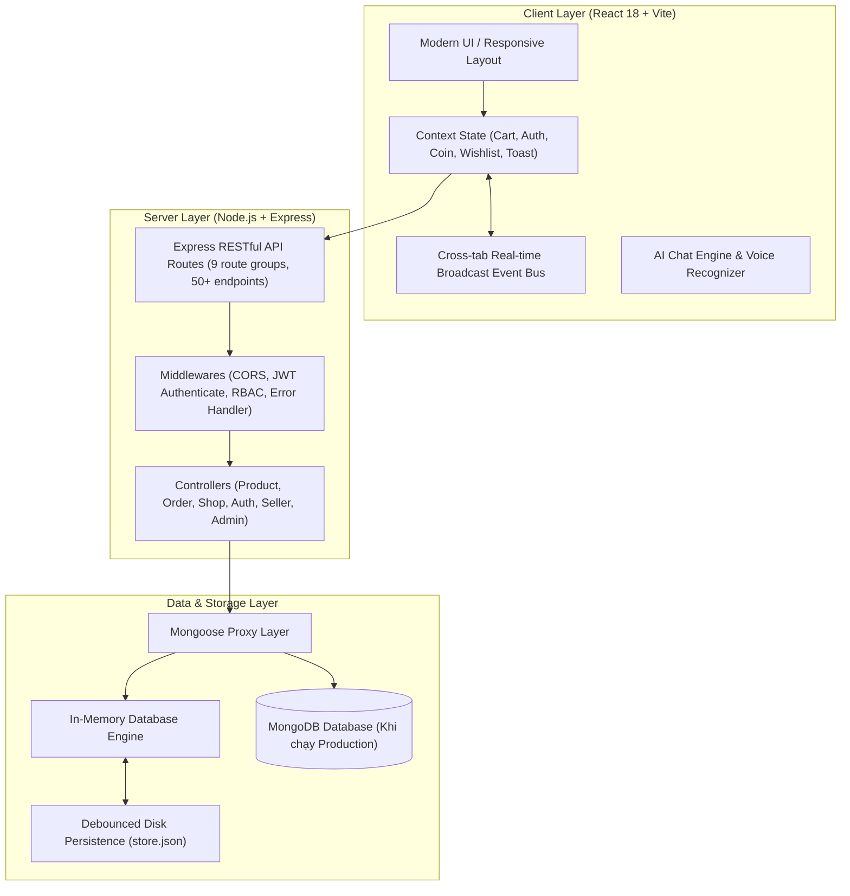

# 🛒 Mini Shopee - Nền Tảng Thương Mại Điện Tử Đa Gian Hàng (Fullstack Multi-Vendor E-Commerce Platform)

[](https://react.dev/)
[](https://vitejs.dev/)
[](https://nodejs.org/)
[](https://expressjs.com/)
[](https://www.mongodb.com/)
[](https://www.docker.com/)
[](https://github.com/JiaysTM17/Fullstack-Ecommerce/actions)
[-brightgreen?style=for-the-badge&logo=checkmarx&logoColor=white)](https://github.com/JiaysTM17/Fullstack-Ecommerce)
[](CONTRIBUTING.md)
[](LICENSE)

> **Mini Shopee** là một nền tảng thương mại điện tử full-stack hiện đại, toàn diện và có độ tin cậy cao được xây dựng theo kiến trúc **Multi-Vendor (Đa gian hàng)**. Dự án tái hiện trọn vẹn trải nghiệm mua sắm thực tế của các sàn TMĐT hàng đầu (như Shopee, TikTok Shop), kết hợp trợ lý ảo **AI Chatbot**, hệ thống **Voucher kép (Dual Stacking)**, đồng bộ dữ liệu thời gian thực **(Real-time State Synchronization)**, phân quyền đa cấp **RBAC (Admin, Seller, Customer)**, và quy trình kiểm thử tự động toàn diện **450 tests (100% Pass)**.

---

## 📑 Mục Lục (Table of Contents)

1. [🗺️ Lộ Trình Phát Triển Chuẩn 8 Giai Đoạn (Fullstack Roadmap)](#️-lộ-trình-phát-triển-chuẩn-8-giai-đoạn-fullstack-roadmap)
2. [🌟 Tính Năng Nổi Bật (Key Features)](#-tính-năng-nổi-bật-key-features)
3. [🏗️ Kiến Trúc Hệ Thống (System Architecture)](#️-kiến-trúc-hệ-thống-system-architecture)
4. [💻 Công Nghệ Sử Dụng (Tech Stack)](#-công-nghệ-sử-dụng-tech-stack)
5. [📂 Cấu Trúc Thư Mục Chuẩn Hóa (Project Directory Structure)](#-cấu-trúc-thư-mục-chuẩn-hóa-project-directory-structure)
6. [🚀 Hướng Dẫn Cài Đặt & Chạy Thử (Quick Start)](#-hướng-dẫn-cài-đặt--chạy-thử-quick-start)
7. [🔑 Tài Khoản Trải Nghiệm Demo (Demo Credentials)](#-tài-khoản-trải-nghiệm-demo-demo-credentials)
8. [📚 Hệ Thống Tài Liệu Kỹ Thuật Chi Tiết (Technical Documentation)](#-hệ-thống-tài-liệu-kỹ-thuật-chi-tiết-technical-documentation)
9. [🧪 Kiểm Thử & Đảm Bảo Chất Lượng (Quality Assurance & Tests)](#-kiểm-thử--đảm-bảo-chất-lượng-quality-assurance--tests)
10. [🤝 Tiêu Chuẩn Cộng Đồng & Đóng Góp (Community & Contributing)](#-tiêu-chuẩn-cộng-đồng--đóng-góp-community--contributing)
11. [👨‍💻 Tác Giả & Liên Hệ (Author & Contact)](#-tác-giả--liên-hệ-author--contact)

---

## 🗺️ Lộ Trình Phát Triển Chuẩn 8 Giai Đoạn (Fullstack Roadmap)

Dự án được thiết kế và triển khai bám sát 100% **Lộ trình khóa học Fullstack Developer 2026 - 2027** và tài liệu **Kiến trúc Website Max Level**:

| Giai Đoạn | Công Nghệ & Khái Niệm Trọng Tâm | Triển Khai Thực Tế Trong Dự Án |
|---|---|---|
| **0. Định Hướng & Setup** | Tư duy lập trình, cài đặt công cụ, Gitflow, tận dụng AI | Workspace chuẩn hóa, cấu hình Node.js 20/24, PowerShell scripts, Git Conventional Commits |
| **1. Frontend Tĩnh** | HTML5 ngữ nghĩa, CSS3 Flexbox/Grid, Responsive Mobile/Desktop | Giao diện TMĐT chuẩn Shopee, Mega Menu, Drawer phân cấp danh mục, PDP, Cart |
| **2. Git & GitHub** | Quản lý mã nguồn, branching, commit convention, PR | Repository công khai trên GitHub [JiaysTM17/Fullstack-Ecommerce](https://github.com/JiaysTM17/Fullstack-Ecommerce), ghi nhận đóng góp liên tục |
| **3. JavaScript Nâng Cao** | ES6+, Async/Await, Array Methods, DOM Events, Closure | Toàn bộ mã nguồn ES Modules, cơ chế Promise, event bus tùy biến 2 chiều |
| **4. ReactJS & State** | React 18, Custom Hooks, Context API, SPA Routing | 5 Contexts độc lập (Cart, Auth, Coin, Wishlist, Toast), 12 Pages, 10+ Components tái sử dụng |
| **5. Backend & Database** | Node.js Express REST API, Mongoose/MongoDB, JWT, RBAC | 9 nhóm API routes, 50+ endpoints, mã hóa mật khẩu bcryptjs, Tenant Isolation |
| **6. DevOps & Deployment** | GitHub Actions CI/CD, Nginx Reverse Proxy, PM2 Process, SSL | Workflow `.github/workflows/ci.yml` tự động build và test khi commit mã nguồn |
| **7. Profile & Documentation** | Tài liệu dự án, Architecture, Data Dictionary, API Spec | Hệ thống 6 tài liệu kỹ thuật chuyên sâu trong thư mục `docs/` |
| **8. Dự Án & Nâng Cao** | Realtime Sync, Smart Voucher Ranking, AI Speech Chatbot | Đồng bộ kho hàng 2 chiều, xếp hạng voucher thông minh, trợ lý ảo nhận diện giọng nói |

---

## 🌟 Tính Năng Nổi Bật (Key Features)

### 🛍️ 1. Phân Hệ Người Mua (Customer Experience)
* **Khám phá sản phẩm linh hoạt:**
  * **Mega Menu Drawer** thông minh: Phân cấp danh mục đa tầng kèm thanh tìm kiếm tức thời và các thẻ subcategory tương tác.
  * Bộ lọc đa tiêu chí: Lọc theo khoảng giá, đánh giá sao, tình trạng kho và phân loại sản phẩm.
  * Tìm kiếm từ khóa theo thời gian thực (Live Search) với gợi ý từ khóa thông minh.
* **Trang Chi Tiết Sản Phẩm (PDP):**
  * Thư viện hình ảnh sắc nét, chọn biến thể (kích thước, màu sắc), hiển thị số lượng tồn kho thực tế.
  * Phù hiệu Shopee Mall, huy hiệu gian hàng chính hãng và cam kết bảo hành.
* **Giỏ Hàng & Hệ Thống Voucher Kép Độc Quyền (Dual Voucher Stacking):**
  * Áp dụng đồng thời 2 loại mã: **Mã giảm giá sản phẩm (%)** VÀ **Mã miễn phí vận chuyển (Freeship)**.
  * Thuật toán **Smart Ranking**: Tự động đưa các mã giảm giá nhiều tiền nhất và đủ điều kiện lên trên cùng kèm huy hiệu 👑 **TỐT NHẤT CHO BẠN**.
* **Trung Tâm Đổi Thưởng & Xu (Rewards Hub & Shopee Coins):**
  * Điểm danh hằng ngày nhận xu, Vòng quay may mắn (Lucky Wheel).
  * Cơ chế trừ xu trực tiếp vào đơn hàng (`1 Xu = 1 VNĐ`), phân tách số dư xu độc lập, bảo mật cho từng tài khoản.
* **Thanh Toán & Hóa Đơn:**
  * Đặt hàng linh hoạt (COD, Thẻ ngân hàng, Ví điện tử VietQR / MoMo).
  * Xuất **Hóa đơn điện tử VAT** chi tiết và In phiếu xuất kho tại trang thanh toán thành công.

---

### 🏪 2. Phân Hệ Người Bán & Chủ Shop (Seller Center)
* **Bảng điều khiển kinh doanh (Seller Dashboard):**
  * Thống kê trực quan: Doanh thu thực tế, số lượng đơn hàng, số sản phẩm tồn kho, đánh giá khách hàng.
  * Phân quyền dữ liệu độc lập giữa các shop và giữa Người bán với Khách hàng (Tenant Isolation).
* **Quản lý kho hàng & Trừ tồn kho tự động (Inventory Sync):**
  * Tồn kho tự động trừ ngay khi khách đặt đơn, tự động phục hồi nếu đơn bị hủy.
  * Cảnh báo sản phẩm sắp hết hàng (*Low Stock Alert*).
* **Xử lý đơn hàng thời gian thực:**
  * Quy trình chuẩn: `Chờ xác nhận & đóng gói` ➔ `Đang giao hàng` ➔ `Giao hàng thành công`.
  * Cập nhật trạng thái đơn đồng bộ tức thì sang Lịch sử đơn hàng của người mua.
  * In phiếu đóng gói hàng chuẩn đơn vị vận chuyển (Packing Slip) kèm mã vận đơn SPX Express.
* **AI Tự động phân loại hàng hóa (Smart Auto-Categorization):**
  * Khi chủ shop nhập tên sản phẩm, bộ nhận diện AI tự động phân tích từ khóa và đề xuất chính xác ngành hàng (Thời trang, Điện tử, Sắc đẹp, Gia dụng, Thể thao,...) chỉ với 1 click.
* **Trang Gian Hàng Thực Tế (Shop Storefront):**
  * Bộ lọc phân loại theo nhóm hàng dạng Tab (ví dụ: *Quần*, *Áo*, *Váy/Đầm*, *Phụ kiện*).
  * **Khối gợi ý sản phẩm chéo (Cross-selling):** Khi khách hàng xem hết phân loại đã chọn, hệ thống tự động hiển thị *"💡 Gợi ý thêm sản phẩm khác từ gian hàng (Bạn có thể cũng thích)"* để kích cầu mua sắm.

---

### 🤖 3. Trợ Lý AI & Chatbot Trực Tuyến (AI Chatbot Engine)
* **Tư vấn thông minh & Tra cứu tự động:**
  * Giải đáp chính sách mua hàng, điều kiện đổi trả, thông tin bảo hành, tra cứu mã giảm giá đang hoạt động.
  * Tra cứu trực tiếp hành trình đơn hàng theo mã đơn ngay trong hộp thoại chat.
* **Công nghệ Nhận diện giọng nói (Voice Speech-to-Text):**
  * Tích hợp Web Speech API cho phép người dùng bấm micro nói câu hỏi thay vì gõ văn bản.
* **Chuyển giao nhân viên tư vấn (AI-to-Human Handover):**
  * Khi gặp vấn đề phức tạp, chatbot tự động kết nối sang phiên trò chuyện với nhân viên hỗ trợ trực tiếp.

---

## 🏗️ Kiến Trúc Hệ Thống (System Architecture)



---

## 💻 Công Nghệ Sử Dụng (Tech Stack)

### 🎨 Frontend
* **Core:** React 18, Vite 5, JavaScript (ES6+ Modules)
* **Routing:** React Router DOM v6
* **State Management:** React Context API (Cart, Auth, Coin, Wishlist, Toast)
* **Styling:** Vanilla CSS3 (Custom Design System, Flexbox, CSS Grid, Responsive)
* **Features:** Web Speech API, LocalStorage Caching, Dual Voucher Calculator

### ⚙️ Backend
* **Runtime:** Node.js (v20 LTS / v24)
* **Framework:** Express.js 4.x (RESTful Architecture)
* **Authentication:** JSON Web Token (JWT), bcryptjs password hashing
* **Authorization:** Role-Based Access Control (RBAC: `admin`, `seller`, `customer`)
* **Security:** CORS whitelist, Tenant Isolation Guard, Input Sanitization

### 🗄️ Database & Storage
* **Primary:** MongoDB + Mongoose ODM
* **In-Memory Fallback:** High-Performance In-Memory DB Engine (Full Mongoose Query API)
* **Disk Persistence:** Debounced JSON Store (`server/data/store.json`, 210KB+ data)

### 🚀 DevOps & CI/CD
* **Automation:** GitHub Actions (`.github/workflows/ci.yml`)
* **Process Management:** PM2 (Cluster Mode)
* **Web Server:** Nginx Reverse Proxy + SSL/TLS Let's Encrypt

---

## 📂 Cấu Trúc Thư Mục Chuẩn Hóa (Project Directory Structure)

```
Website-Thuong-Mai-Dien-Tu-Mini-Plan/
├── .github/                       # Cấu hình tự động hóa & tiêu chuẩn GitHub
│   ├── ISSUE_TEMPLATE/            # Mẫu báo cáo lỗi & yêu cầu tính năng
│   │   ├── bug_report.md
│   │   └── feature_request.md
│   ├── workflows/
│   │   └── ci.yml                 # GitHub Actions CI/CD Pipeline
│   ├── PULL_REQUEST_TEMPLATE.md   # Mẫu tiêu chuẩn cho Pull Request
│   └── dependabot.yml             # Cấu hình tự động quét cập nhật bảo mật phụ thuộc
├── client/                        # Mã nguồn ứng dụng Frontend (React + Vite)
│   ├── public/                    # Tài nguyên tĩnh công khai (favicon, banners)
│   ├── src/
│   │   ├── components/            # UI Components tái sử dụng (Header, Footer, ProductCard,...)
│   │   ├── context/               # Global State (CartContext, AuthContext, CoinContext,...)
│   │   ├── pages/                 # Các trang giao diện (HomePage, PDP, Cart, Checkout, Seller, Admin)
│   │   ├── services/              # Tầng gọi API tập trung (api.js, productService.js,...)
│   │   ├── styles/                # Toàn bộ mã nguồn CSS thiết kế theo module
│   │   ├── utils/                 # Các hàm tiện ích dùng chung (formatCurrency, validation)
│   │   ├── App.jsx                # Định tuyến ứng dụng React Router
│   │   └── main.jsx               # Entry point ứng dụng React
│   ├── .dockerignore              # Danh sách loại trừ khi đóng gói Docker frontend
│   ├── Dockerfile                 # Multi-stage Docker build & Nginx serving
│   ├── nginx.conf                 # Cấu hình Nginx reverse proxy cho SPA client
│   ├── package.json               # Dependencies Frontend
│   └── vite.config.js             # Cấu hình Vite build tool
├── server/                        # Mã nguồn máy chủ Backend (Node.js + Express)
│   ├── data/
│   │   └── store.json             # Cơ sở dữ liệu sao lưu đĩa tự động (Persistence Store)
│   ├── src/
│   │   ├── config/                # Cấu hình môi trường và kết nối Database
│   │   ├── controllers/           # Tầng xử lý nghiệp vụ (Product, Order, Seller, Admin, Auth)
│   │   ├── middlewares/           # Tầng lọc bảo mật (JWT Authenticate, RBAC, Error Handler)
│   │   ├── models/                # Schemas Mongoose & In-Memory Store Engine
│   │   ├── routes/                # 9 nhóm định tuyến RESTful API
│   │   ├── seed/                  # Dữ liệu hạt giống khởi tạo (109 sản phẩm, 12 shops, 10 vouchers)
│   │   ├── utils/                 # Tiện ích backend (response helper, persistence disk writer)
│   │   └── app.js                 # Cấu hình ứng dụng Express
│   ├── .dockerignore              # Danh sách loại trừ khi đóng gói Docker backend
│   ├── Dockerfile                 # Production Container image cho Express backend
│   ├── package.json               # Dependencies Backend
│   └── server.js                  # Entry point khởi chạy HTTP Server (Port 5000)
├── docs/                          # Hệ thống tài liệu kỹ thuật chuyên sâu (Max Level)
│   ├── roadmap.md                 # Đối chiếu lộ trình Fullstack Developer 8 giai đoạn
│   ├── api.md                     # Đặc tả chi tiết 9 nhóm RESTful API endpoints
│   ├── postman_collection.json    # Bộ request mẫu Postman v2.1.0 sẵn sàng import
│   ├── architecture.md            # Sơ đồ kiến trúc luồng dữ liệu và Tenant Isolation
│   ├── database.md                # Thiết kế cơ sở dữ liệu, ER Diagram & Data Dictionary
│   ├── security.md                # Chính sách bảo mật, chuẩn OWASP và RBAC Guard
│   ├── testing.md                 # Chiến lược kiểm thử tự động toàn diện (450 tests)
│   ├── deployment.md              # Hướng dẫn triển khai Production (VPS, PM2, Nginx, Docker)
│   └── progress/                  # Nhật ký tiến độ phát triển dự án
├── tests/                         # Bộ kiểm thử tự động toàn diện (450 tests)
│   ├── harness/                   # Khung chạy kiểm thử
│   ├── tier1_features/            # Kiểm thử tính năng cơ bản
│   ├── tier2_boundaries/          # Kiểm thử giá trị biên và validation
│   ├── tier3_combinations/        # Kiểm thử tích hợp đa điều kiện
│   ├── tier4_scenarios/           # Kiểm thử kịch bản người dùng thực tế
│   └── run-all.js                 # Script thực thi toàn bộ 450 tests
├── .dockerignore                  # Loại trừ tệp rác khi build root Docker
├── .env.example                   # Biến môi trường mẫu cho toàn dự án
├── CODE_OF_CONDUCT.md             # Quy tắc ứng xử cộng đồng theo chuẩn Contributor Covenant
├── CONTRIBUTING.md                # Hướng dẫn đóng góp mã nguồn & Gitflow chuẩn
├── docker-compose.yml             # Điều phối đa container (MongoDB, Backend, Frontend SPA)
├── LICENSE                        # Giấy phép mã nguồn mở MIT License
├── package.json                   # Root monorepo scripts quản lý toàn diện dự án
├── README.md                      # Tài liệu tổng quan dự án (Recruiter-ready)
└── SECURITY.md                    # Chính sách báo cáo & xử lý lỗ hổng bảo mật
```

---

## 🚀 Hướng Dẫn Cài Đặt & Chạy Thử (Quick Start)

### Yêu Cầu Môi Trường (Prerequisites)
* **Node.js:** v18.x trở lên (Khuyến nghị Node.js v20 LTS hoặc v24)
* **Trình quản lý gói:** npm hoặc yarn
* **Git** cài đặt trên máy
* *(Tùy chọn)* **Docker & Docker Compose** nếu muốn chạy qua container

### 1. Khởi Chạy Nhanh 1-Click Bằng Docker Compose (Khuyến nghị)
Toàn bộ hệ thống (Frontend SPA, Backend API, MongoDB) đã được đóng gói sẵn sàng:
```bash
# Clone mã nguồn
git clone https://github.com/JiaysTM17/Fullstack-Ecommerce.git
cd Fullstack-Ecommerce

# Khởi chạy toàn bộ hệ thống
docker-compose up -d --build

# Truy cập ứng dụng:
# -> Frontend: http://localhost:80 (hoặc http://localhost:5173 khi chạy dev)
# -> Backend:  http://localhost:5000/api/health
```

### 2. Khởi Chạy Nhanh Bằng Kịch Bản (Dành cho Windows)
```powershell
# Chạy máy chủ Backend (Port 5000)
.\run-server.cmd

# Mở cửa sổ mới, chạy giao diện Frontend (Port 5173)
.\run-client.cmd

# Chạy toàn bộ 450 kiểm thử tự động
.\run-tests.cmd
```

### 3. Khởi Chạy Thủ Công Từng Phần
```bash
# 1. Clone mã nguồn
git clone https://github.com/JiaysTM17/Fullstack-Ecommerce.git
cd Fullstack-Ecommerce

# 2. Cài đặt và khởi chạy Backend Server
cd server
npm install
npm start
# -> Backend lắng nghe tại: http://localhost:5000

# 3. Mở Terminal mới, cài đặt và khởi chạy Frontend
cd client
npm install
npm run dev
# -> Frontend truy cập tại: http://localhost:5173
```

---

## 🔑 Tài Khoản Trải Nghiệm Demo (Demo Credentials)

Hệ thống tích hợp sẵn tính năng **Đăng Nhập Nhanh 1-Click** tại trang `/login`:

| Vai Trò (Role) | Email Đăng Nhập | Mật Khẩu | Quyền Hạn Trải Nghiệm |
|---|---|---|---|
| 👑 **Quản Trị Viên (Admin)** | `admin@shopee.vn` | `admin123` | Quản trị toàn sàn, khóa/mở shop, phát hành voucher sàn, duyệt sản phẩm |
| 👗 **Chủ Shop Thời Trang (Seller)** | `seller.fashion@shopee.vn` | `seller123` | Quản lý Shop Thời Trang GenZ, xem đơn, xác nhận giao hàng, thêm sản phẩm |
| 💻 **Chủ Shop Công Nghệ (Seller)** | `seller.tech@shopee.vn` | `seller123` | Quản lý Shop TechWorld, điều chỉnh tồn kho, xem doanh thu độc lập |
| 🛍️ **Người Mua Hàng (Customer)** | `customer@gmail.com` | `customer123` | Duyệt hàng, áp mã Freeship + Giảm giá, đổi xu thưởng, theo dõi đơn |

---

## 📚 Hệ Thống Tài Liệu Kỹ Thuật Chi Tiết (Technical Documentation)

* [🗺️ Lộ Trình Phát Triển & Đối Chiếu 8 Giai Đoạn (docs/roadmap.md)](docs/roadmap.md)
* [🔌 Tài Liệu Đặc Tả 9 Nhóm RESTful API (docs/api.md)](docs/api.md)
* [📬 Bộ Thử Nghiệm API Postman Collection v2.1.0 (docs/postman_collection.json)](docs/postman_collection.json)
* [🏗️ Kiến Trúc Hệ Thống & Luồng Request-Response (docs/architecture.md)](docs/architecture.md)
* [🗄️ Thiết Kế Cơ Sở Dữ Liệu & Data Dictionary 7 Bảng (docs/database.md)](docs/database.md)
* [🔒 Chính Sách Bảo Mật, Chuẩn OWASP & Phân Quyền RBAC (docs/security.md)](docs/security.md)
* [🧪 Chiến Lược & Cấu Trúc 4 Tầng Kiểm Thử 450 Tests (docs/testing.md)](docs/testing.md)
* [🚀 Hướng Dẫn Triển Khai Production: VPS, Nginx, PM2 & Docker (docs/deployment.md)](docs/deployment.md)

---

## 🧪 Kiểm Thử & Đảm Bảo Chất Lượng (Quality Assurance & Tests)

Dự án áp dụng quy trình kiểm thử tự động nghiêm ngặt gồm **450 tests** được tổ chức theo 4 tầng tiêu chuẩn:

* **Tier 1 (Core Features):** 115 tests kiểm thử các tính năng độc lập (giỏ hàng, phân trang, lọc giá, tìm kiếm).
* **Tier 2 (Boundary & Validation):** 110 tests kiểm tra giá trị biên (tồn kho âm, voucher quá hạn, vượt mức giảm tối đa).
* **Tier 3 (Combinations):** 110 tests kiểm tra sự kết hợp (áp đồng thời 2 voucher, thanh toán bằng xu + mã giảm giá).
* **Tier 4 (Real-world Scenarios):** 115 tests kiểm tra hành trình người dùng hoàn chỉnh (đặt hàng ➔ trừ kho ➔ người bán xác nhận ➔ người mua kiểm tra hành trình).

```bash
# Thực thi toàn bộ kiểm thử
node tests/run-all.js
```
*Kết quả:* **`450/450 tests passed (100% Pass Rate)`**.

---

## 🤝 Tiêu Chuẩn Cộng Đồng & Đóng Góp (Community & Contributing)

Dự án cam kết tuân thủ các chuẩn mực mã nguồn mở cao nhất:

* 📖 **[Hướng Dẫn Đóng Góp (CONTRIBUTING.md)](CONTRIBUTING.md):** Quy trình tạo nhánh (branching), quy ước đặt tên commit (Conventional Commits), và hướng dẫn tạo Pull Request.
* 📜 **[Quy Tắc Ứng Xử (CODE_OF_CONDUCT.md)](CODE_OF_CONDUCT.md):** Tiêu chuẩn ứng xử văn minh dựa trên Contributor Covenant v2.1.
* 🛡️ **[Chính Sách Bảo Mật (SECURITY.md)](SECURITY.md):** Hướng dẫn báo cáo và quy trình xử lý lỗ hổng bảo mật có trách nhiệm.
* ⚖️ **[Giấy Phép Bản Quyền (LICENSE)](LICENSE):** Được phân phối theo giấy phép MIT License, hoàn toàn tự do sử dụng cho mục đích học tập và phát triển.

---

## 👨‍💻 Tác Giả & Liên Hệ (Author & Contact)

* **Họ và tên:** Kiệt Trương ([JiaysTM17](https://github.com/JiaysTM17))
* **Email:** truonggiakiet110806@gmail.com
* **GitHub Repository:** [https://github.com/JiaysTM17/Fullstack-Ecommerce](https://github.com/JiaysTM17/Fullstack-Ecommerce)
* **Vị trí hướng tới:** Fullstack Web Developer (React.js, Node.js, Express, MongoDB)

---

*Dự án được xây dựng với mục tiêu thể hiện năng lực lập trình Fullstack toàn diện, tư duy kiến trúc hệ thống chuẩn mực và sẵn sàng đáp ứng các tiêu chuẩn tuyển dụng khắt khe nhất.*
