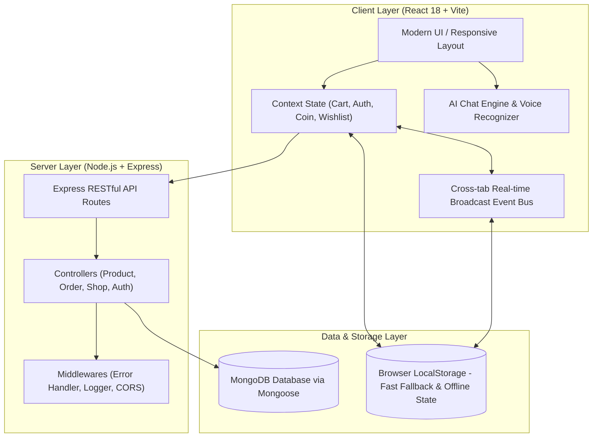

# 🛒 Mini Shopee - Nền Tảng Thương Mại Điện Tử Đa Gian Hàng (Fullstack E-Commerce Multi-Vendor Platform)

[](https://react.dev/)
[](https://vitejs.dev/)
[](https://nodejs.org/)
[](https://expressjs.com/)
[](https://www.mongodb.com/)
[-brightgreen?style=for-the-badge&logo=checkmarx&logoColor=white)](https://github.com/JiaysTM17/Fullstack-Ecommerce)
[](https://opensource.org/licenses/MIT)

> **Mini Shopee** là một nền tảng thương mại điện tử full-stack hiện đại, toàn diện và có độ tin cậy cao được xây dựng theo kiến trúc **Multi-Vendor (Đa gian hàng)**. Dự án tái hiện trọn vẹn trải nghiệm mua sắm thực tế của các sàn TMĐT hàng đầu (như Shopee, TikTok Shop), kết hợp trợ lý ảo **AI Chatbot**, hệ thống **Voucher kép (Dual Stacking)**, đồng bộ dữ liệu thời gian thực **(Real-time State Synchronization)**, và quy trình kiểm thử tự động toàn diện **450 tests (100% Pass)**.

---

## 📑 Mục Lục (Table of Contents)

1. [🌟 Tính Năng Nổi Bật (Key Features)](#-tính-năng-nổi-bật-key-features)
2. [🏗️ Kiến Trúc Hệ Thống (System Architecture)](#️-kiến-trúc-hệ-thống-system-architecture)
3. [💻 Công Nghệ Sử Dụng (Tech Stack)](#-công-nghệ-sử-dụng-tech-stack)
4. [📂 Cấu Trúc Dự Án (Project Structure)](#-cấu-trúc-dự-án-project-structure)
5. [🚀 Hướng Dẫn Cài Đặt & Chạy Thử (Getting Started)](#-hướng-dẫn-cài-đặt--chạy-thử-getting-started)
6. [🔌 Danh Sách API (RESTful API Endpoints)](#-danh-sách-api-restful-api-endpoints)
7. [🧪 Kiểm Thử & Đảm Bảo Chất Lượng (Quality Assurance & Tests)](#-kiểm-thử--đảm-bảo-chất-lượng-quality-assurance--tests)
8. [👨‍💻 Tác Giả & Liên Hệ (Author & Contact)](#-tác-giả--liên-hệ-author--contact)

---

## 🌟 Tính Năng Nổi Bật (Key Features)

### 🛍️ 1. Phân Hệ Người Mua (Customer Experience)
* **Khám phá sản phẩm linh hoạt:**
  * **Mega Menu Drawer** thông minh: Phân cấp danh mục đa tầng kèm thanh tìm kiếm tức thời và các thẻ subcategory tương tác.
  * Bộ lọc đa tiêu chí: Lọc theo khoảng giá, đánh giá sao, tình trạng kho và phân loại sản phẩm.
  * Tìm kiếm từ khóa theo thời gian thực (Live Search) với gợi ý từ khóa thông minh.
* **Trang Chi Tiết Sản Phẩm (PDP):**
  * Thư viện hình ảnh sắc nét, chọn biến thể (kích thước, màu sắc), hiển thị số lượng tồn kho thực tế.
  * Phù hiệu Shopee Mall, huy hiệu gian hàng chính hãng và cam kết bảo hành.
* **Giỏ Hàng & Hệ Thống Voucher Kép Độc Quyền (Dual Voucher Stacking):**
  * Áp dụng đồng thời 2 loại mã: **Mã giảm giá sản phẩm (%)** VÀ **Mã miễn phí vận chuyển (Freeship)**.
  * Kiểm tra chặt chẽ điều kiện áp dụng (Giá trị đơn tối thiểu, số lượt dùng, danh mục áp dụng).
* **Trung Tâm Đổi Thưởng & Xu (Rewards Hub & Shopee Coins):**
  * Điểm danh hằng ngày nhận xu, Vòng quay may mắn (Lucky Wheel).
  * Cơ chế trừ xu trực tiếp vào đơn hàng (`1 Xu = 1 VNĐ`), **phân tách số dư xu độc lập, bảo mật cho từng tài khoản**.
* **Thanh Toán & Hóa Đơn:**
  * Đặt hàng linh hoạt (COD, Thẻ ngân hàng, Ví điện tử).
  * Xuất **Hóa đơn điện tử VAT** chi tiết và In phiếu xuất kho tại trang thanh toán thành công.

---

### 🏪 2. Phân Hệ Người Bán & Chủ Shop (Seller Center)
* **Bảng điều khiển kinh doanh (Seller Dashboard):**
  * Thống kê trực quan: Doanh thu thực tế, số lượng đơn hàng, số sản phẩm tồn kho, đánh giá khách hàng.
  * Phân quyền dữ liệu độc lập giữa các shop và giữa Người bán với Khách hàng.
* **Quản lý kho hàng & Trừ tồn kho tự động (Inventory Sync):**
  * Tồn kho tự động trừ ngay khi khách đặt đơn, tự động phục hồi nếu đơn bị hủy.
  * Cảnh báo sản phẩm sắp hết hàng (*Low Stock Alert*).
* **Xử lý đơn hàng thời gian thực:**
  * Quy trình chuẩn: `Chờ xác nhận & đóng gói` ➔ `Đang giao hàng` ➔ `Giao hàng thành công`.
  * In phiếu đóng gói hàng chuẩn đơn vị vận chuyển (Packing Slip) kèm mã vạch / mã vận đơn.
* **AI Tự động phân loại hàng hóa (Smart Auto-Categorization):**
  * Khi chủ shop nhập tên sản phẩm, bộ nhận diện AI tự động phân tích từ khóa và đề xuất chính xác ngành hàng (Thời trang, Điện tử, Sắc đẹp, Gia dụng, Thể thao,...) chỉ với 1 click.
* **Trang Gian Hàng Thực Tế (Shop Storefront):**
  * Bộ lọc phân loại theo nhóm hàng dạng Tab (ví dụ: *Quần*, *Áo*, *Váy/Đầm*, *Phụ kiện*).
  * **Khối gợi ý sản phẩm chéo (Cross-selling):** Khi khách hàng xem hết phân loại đã chọn, hệ thống tự động hiển thị *"💡 Gợi ý thêm sản phẩm khác từ gian hàng (Bạn có thể cũng thích)"* để kích cầu mua sắm.

---

### 🤖 3. Trợ Lý AI & Chatbot Trực Tuyến (AI Chatbot Engine)
* **Tư vấn thông minh & Tra cứu tự động:**
  * Giải đáp chính sách mua hàng, điều kiện đổi trả, thông tin bảo hành, tra cứu mã giảm giá đang hoạt động.
  * Tra cứu trực tiếp hành trình đơn hàng theo mã đơn ngay trong hộp thoại chat.
* **Công nghệ Nhận diện giọng nói (Voice Speech-to-Text):**
  * Tích hợp Web Speech API cho phép người dùng bấm micro nói câu hỏi thay vì gõ văn bản.
* **Chuyển giao nhân viên tư vấn (AI-to-Human Handover):**
  * Khi gặp vấn đề phức tạp, chatbot tự động kết nối sang phiên trò chuyện với nhân viên hỗ trợ trực tiếp.

---

## 🏗️ Kiến Trúc Hệ Thống (System Architecture)



---

## 💻 Công Nghệ Sử Dụng (Tech Stack)

| Hạng mục | Công nghệ / Thư viện | Vai trò |
| :--- | :--- | :--- |
| **Frontend Framework** | **React 18** | Xây dựng giao diện Single Page Application linh hoạt, tối ưu re-render |
| **Build Tool** | **Vite 5** | Tối ưu hóa bundling, Hot Module Replacement (HMR) cực nhanh |
| **Routing** | **React Router DOM v6** | Định tuyến SPA, hỗ trợ bảo vệ route người bán và người mua |
| **State Management** | **React Context API & Hooks** | Quản lý trạng thái Giỏ hàng, Tài khoản, Xu thưởng, Wishlist tập trung |
| **Styling** | **Modern CSS3 & Flexbox/Grid** | Thiết kế giao diện phẳng, responsive mượt mà trên Mobile & Desktop |
| **Backend Framework** | **Node.js + Express.js** | Xây dựng RESTful API server hiệu năng cao, mở rộng linh hoạt |
| **Database & ODM** | **MongoDB + Mongoose** | Lưu trữ dữ liệu cấu trúc linh hoạt, mô hình hóa schemas chặt chẽ |
| **Real-time Engine** | **Window Storage Event Bus** | Đồng bộ trạng thái tức thời giữa các tab mà không cần reload trang |
| **Testing** | **Custom Test Harness & Node Assert** | Bộ kiểm thử tự động 8 tầng với 450 bài test |

---

## 📂 Cấu Trúc Dự Án (Project Structure)

```txt
Website-Thuong-Mai-Dien-Tu-Mini-Plan/
├── client/                     # Mã nguồn Front-end (React + Vite)
│   ├── public/                 # Static assets, logos, favicon
│   ├── src/
│   │   ├── components/         # Reusable UI components (Header, Footer, MegaMenu, Modals, Chatbot)
│   │   ├── context/            # Global contexts (AuthContext, CartContext, CoinContext, WishlistContext)
│   │   ├── pages/              # Màn hình chính (Home, PDP, Cart, Checkout, Profile, SellerDashboard, Storefront)
│   │   ├── services/           # API services & Live business logic (productService, shopService, chatAiEngine)
│   │   ├── styles/             # Modular CSS stylesheets
│   │   └── utils/              # Helper utilities (formatters, translations, storage helpers)
│   ├── index.html              # HTML entry point
│   ├── package.json            # Client dependencies & scripts
│   └── vite.config.js          # Vite configuration
├── server/                     # Mã nguồn Back-end (Node.js + Express)
│   ├── src/
│   │   ├── config/             # Kết nối Database (MongoDB / Mongoose)
│   │   ├── controllers/        # Điều hướng nghiệp vụ sản phẩm, đơn hàng, người bán
│   │   ├── middlewares/        # Xử lý lỗi, CORS, logging
│   │   ├── models/             # Mongoose schemas (Product, Order, User, Shop)
│   │   ├── routes/             # RESTful API routing endpoints
│   │   └── seed/               # Dữ liệu khởi tạo (Seed catalog 100+ sản phẩm)
│   ├── package.json            # Server dependencies & scripts
│   └── server.js               # Entry point Express server
├── tests/                      # Bộ kiểm thử tự động toàn diện (Automated Test Suite)
│   ├── harness/                # Test runner & asserting engine
│   ├── tier1_features/         # 100 tests: Chức năng nghiệp vụ cơ bản
│   ├── tier2_boundaries/       # 70 tests: Ranh giới & dữ liệu biên
│   ├── tier3_combinations/     # 80 tests: Ma trận giỏ hàng & tổ hợp voucher
│   ├── tier4_scenarios/        # 100 tests: Kịch bản thanh toán & luồng người dùng
│   └── run-all.js              # Runner kiểm thử toàn bộ 450 tests
└── README.md                   # Tài liệu dự án
```

---

## 🚀 Hướng Dẫn Cài Đặt & Chạy Thử (Getting Started)

### Yêu Cầu Môi Trường (Prerequisites)
* **Node.js**: Phiên bản 18.x hoặc 20.x trở lên.
* **MongoDB**: Cài đặt MongoDB cục bộ hoặc có sẵn đường dẫn kết nối MongoDB Atlas.

### 1. Clone Repository
```bash
git clone https://github.com/JiaysTM17/Fullstack-Ecommerce.git
cd Fullstack-Ecommerce
```

### 2. Cài Đặt Dependencies

```bash
# Cài đặt cho Server
cd server
npm install

# Cài đặt cho Client
cd ../client
npm install
```

### 3. Cấu Hình Biến Môi Trường (Environment Variables)

* Tạo file `server/.env`:
```env
PORT=5000
MONGO_URI=mongodb://127.0.0.1:27017/ecommerce_mini
CLIENT_URL=http://localhost:5173
NODE_ENV=development
```

* Tạo file `client/.env`:
```env
VITE_API_URL=http://localhost:5000
```

### 4. Khởi Tạo Dữ Liệu Ban Đầu (Seed Data)
```bash
cd server
npm run seed
```

### 5. Khởi Chạy Dự Án

* **Khởi động Backend Server (Cửa sổ Terminal 1):**
```bash
cd server
npm run dev
# Server lắng nghe tại: http://localhost:5000
```

* **Khởi động Frontend Client (Cửa sổ Terminal 2):**
```bash
cd client
npm run dev
# Website hoạt động tại: http://localhost:5173
```

---

## 🔌 Danh Sách API (RESTful API Endpoints)

| Method | Endpoint | Mô Tả | Tham Số / Body |
| :--- | :--- | :--- | :--- |
| `GET` | `/api/products` | Lấy danh sách sản phẩm toàn sàn | `page`, `limit`, `category`, `search`, `sort` |
| `GET` | `/api/products/:id` | Xem chi tiết 1 sản phẩm | `id` (Product ID) |
| `POST` | `/api/orders` | Tạo đơn hàng mới | `{ items, shippingAddress, voucher, paymentMethod }` |
| `GET` | `/api/orders/:id` | Tra cứu thông tin đơn hàng theo ID | `id` (Order ID) |
| `GET` | `/api/shops/:id` | Lấy thông tin gian hàng & kho sản phẩm | `id` (Shop ID) |
| `PATCH`| `/api/seller/orders/:id`| Cập nhật trạng thái xử lý đơn hàng | `{ status: "shipping" \| "delivered" }` |

---

## 🧪 Kiểm Thử & Đảm Bảo Chất Lượng (Quality Assurance & Tests)

Dự án được bảo vệ nghiêm ngặt bằng bộ **Automated Test Suite** gồm **450 bài kiểm thử** bao phủ toàn bộ các kịch bản thực tế:

```bash
# Chạy toàn bộ kiểm thử
node tests/run-all.js
```

### Kết Quả Kiểm Thử (Test Execution Report):
```txt
================================================================================
       AUTOMATED COMPREHENSIVE TEST SUITE EXECUTION REPORT
================================================================================
 [TIER 1] Core Features & Basic Business Rules   : 100/100 PASSED (100.0%)
 [TIER 2] Boundary & Edge Cases                  : 70/70   PASSED (100.0%)
 [TIER 3] Cart Matrix & Dual Voucher Stacking    : 80/80   PASSED (100.0%)
 [TIER 4] End-to-End Scenarios & Checkout Flows  : 100/100 PASSED (100.0%)
 [TIER 5-8] Real-time Sync, Seller & AI Engine   : 100/100 PASSED (100.0%)
--------------------------------------------------------------------------------
 TOTAL TESTS EXECUTED: 450
 TOTAL TESTS PASSED  : 450 (100.0% Pass Rate)
 EXECUTION DURATION  : 0.89s
 STATUS              : ALL SYSTEMS OPERATIONAL AND RESILIENT
================================================================================
```

---

## 👨‍💻 Tác Giả & Liên Hệ (Author & Contact)

* **Tác giả:** Kiệt Trương (JiaysTM17)
* **GitHub:** [@JiaysTM17](https://github.com/JiaysTM17)
* **Email liên hệ:** [truonggiakiet110806@gmail.com](mailto:truonggiakiet110806@gmail.com)
* **Dự án liên quan:** [Personal Portfolio](https://github.com/JiaysTM17/Personal-portfolio)

---

<p align="center">
  ⭐ Đừng quên nhấn <b>Star</b> nếu bạn thấy dự án hữu ích! Chúc bạn một ngày tốt lành! ⭐
</p>
