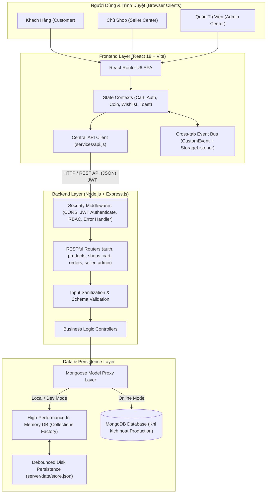
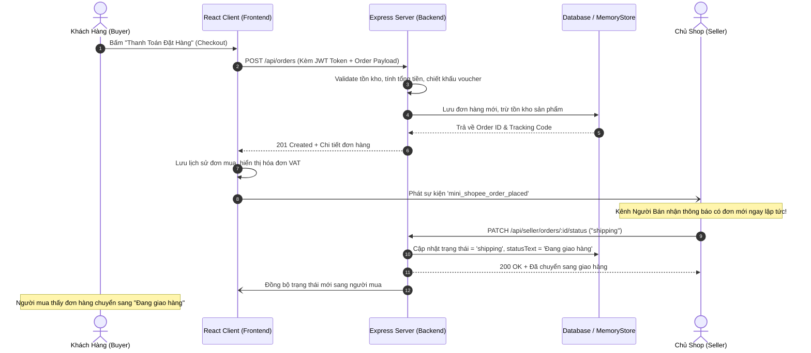

# 🏗️ KIẾN TRÚC HỆ THỐNG (SYSTEM ARCHITECTURE)

> **Dự án:** Mini Shopee - Nền Tảng Thương Mại Điện Tử Đa Gian Hàng  
> **Mô hình kiến trúc:** Client-Server tách biệt, Event-Driven Cross-Tab Sync, In-Memory DB Proxy & Disk Persistence.

---

## 🗺️ 1. SƠ ĐỒ KIẾN TRÚC TỔNG THỂ

---

## 🔄 2. LUỒNG XỬ LÝ REQUEST-RESPONSE CHI TIẾT

---

## 🛡️ 3. MÔ HÌNH PHÂN QUYỀN ĐA GIAN HÀNG (MULTI-TENANT ISOLATION)

Hệ thống Mini Shopee áp dụng quy tắc **Cô Lập Dữ Liệu Theo Gian Hàng (Tenant Isolation)**:

1. **Người Mua (Customer):**
   - Chỉ xem và quản lý giỏ hàng, xu thưởng, đơn mua của chính tài khoản mình.
   - Không được phép can thiệp vào giá bán, tồn kho hoặc đơn hàng của các tài khoản khác.

2. **Người Bán (Seller):**
   - Tài khoản người bán được gắn cố định với một `shopId` cụ thể trong JWT payload.
   - Middleware `requireShopAccess()` kiểm tra nghiêm ngặt: Mọi thao tác cập nhật sản phẩm (`PUT /api/seller/products/:id`) hoặc đơn hàng (`PATCH /api/seller/orders/:id/status`) chỉ có hiệu lực với dữ liệu thuộc quyền sở hữu của `req.user.shopId`.
   - Ngăn chặn hoàn toàn lỗi bảo mật IDOR (Insecure Direct Object Reference).

3. **Quản Trị Viên (Admin):**
   - Toàn quyền giám sát chỉ số vĩ mô toàn sàn.
   - Khóa / mở khóa gian hàng vi phạm chính sách TMĐT.
   - Phát hành hoặc thu hồi voucher khuyến mãi trên phạm vi toàn hệ thống.

---

## 💾 4. CƠ CHẾ LƯU TRỮ VÀ DỰ PHÒNG KÉP (DUAL-TIER PERSISTENCE)

Hệ thống được thiết kế để **không bao giờ bị gián đoạn hoạt động (Zero Downtime / High Resilience)**:

| Môi Trường | Cơ Chế Chính | Cơ Chế Dự Phòng (Fallback) |
|---|---|---|
| **Production Cloud** | MongoDB Atlas Cluster kết nối qua chuỗi `MONGO_URI` với Mongoose ODM | Tự động ghi nhật ký lỗi kết nối và chuyển sang In-memory nếu timeout |
| **Local Development** | In-Memory Database mô phỏng 100% cú pháp Mongoose | Tự động lưu toàn bộ dữ liệu xuống đĩa tại `server/data/store.json` (Debounce 500ms) để không bị mất dữ liệu khi restart server |
| **Client Offline Mode** | Gọi REST API trực tiếp đến máy chủ backend | Nếu máy chủ tắt, tầng `services/` tự động đọc dữ liệu từ `localStorage` để người dùng vẫn trải nghiệm giao diện liền mạch |
