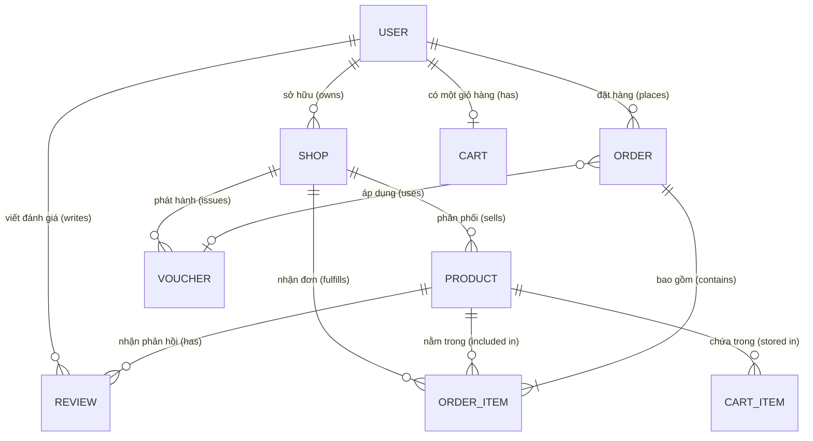

# 🗄️ THIẾT KẾ CƠ SỞ DỮ LIỆU (DATABASE SCHEMA & DATA DICTIONARY)

> **Dự án:** Mini Shopee Multi-Vendor E-Commerce  
> **Kiến trúc dữ liệu:** Document-Oriented NoSQL (Tương thích MongoDB & Mongoose ODM)

---

## 📊 1. SƠ ĐỒ THỰC THỂ QUAN HỆ (ER DIAGRAM)

---

## 📋 2. CHI TIẾT CÁC BẢNG DỮ LIỆU (COLLECTIONS DATA DICTIONARY)

### 1. `users` (Tài khoản người dùng)
| Trường | Kiểu dữ liệu | Bắt buộc | Mô tả |
|---|---|:---:|---|
| `_id` | String / ObjectId | Có | Định danh duy nhất của người dùng |
| `fullName` | String | Có | Họ và tên đầy đủ |
| `email` | String | Có | Email đăng nhập (Unique, có index) |
| `password` | String | Có | Mật khẩu đã được mã hóa bằng `bcryptjs` |
| `phone` | String | Không | Số điện thoại liên hệ nhận hàng |
| `role` | String | Có | Phân quyền: `'customer'` \| `'seller'` \| `'admin'` |
| `shopId` | String | Không | Mã gian hàng liên kết (Dành riêng cho Seller) |
| `coinBalance` | Number | Có | Số dư xu Shopee hiện có (Mặc định: 0) |
| `addresses` | Array | Không | Danh sách sổ địa chỉ nhận hàng |
| `createdAt` | Date / ISOString | Có | Thời điểm đăng ký tài khoản |

---

### 2. `shops` (Gian hàng bán hàng - Shopee Mall)
| Trường | Kiểu dữ liệu | Bắt buộc | Mô tả |
|---|---|:---:|---|
| `_id` / `shopId` | String | Có | Mã gian hàng duy nhất (ví dụ: `'shop_01'`) |
| `name` | String | Có | Tên gian hàng chính thức |
| `ownerId` | String | Có | Mã người dùng sở hữu shop |
| `category` | String | Có | Ngành hàng chủ đạo (Thời trang, Điện tử,...) |
| `logo` / `avatar` | String | Có | Đường dẫn ảnh đại diện gian hàng |
| `rating` | Number | Có | Điểm đánh giá trung bình (1.0 - 5.0) |
| `followers` | Number | Có | Số lượng người theo dõi |
| `responseRate` | Number | Có | Tỉ lệ phản hồi tin nhắn (%) |
| `status` | String | Có | Trạng thái: `'active'` (Đang bán) \| `'locked'` (Bị khóa) |
| `commissionRate`| Number | Có | Tỉ lệ chiết khấu sàn (Mặc định: 0.05 tức 5%) |

---

### 3. `products` (Sản phẩm phân phối)
| Trường | Kiểu dữ liệu | Bắt buộc | Mô tả |
|---|---|:---:|---|
| `_id` / `id` | String | Có | Mã sản phẩm duy nhất (ví dụ: `'prod_01'`) |
| `shopId` | String | Có | Gian hàng sở hữu (Khóa ngoại tham chiếu `shops`) |
| `shopName` | String | Có | Tên gian hàng hiển thị nhanh |
| `name` | String | Có | Tên sản phẩm đầy đủ |
| `slug` | String | Có | Đường dẫn thân thiện SEO (Unique) |
| `description` | String | Không | Mô tả thông tin chi tiết sản phẩm |
| `price` | Number | Có | Giá bán thực tế hiện tại (VNĐ) |
| `originalPrice`| Number | Có | Giá niêm yết trước khi giảm giá (VNĐ) |
| `stock` | Number | Có | Số lượng tồn kho sẵn sàng bán |
| `sold` | Number | Có | Số lượng đã bán lũy kế |
| `category` | String | Có | Danh mục (Thời trang, Điện tử, Sắc đẹp,...) |
| `brand` | String | Không | Thương hiệu sản phẩm |
| `image` | String | Có | Ảnh đại diện chính của sản phẩm |
| `images` | Array | Không | Bộ sưu tập ảnh sản phẩm chi tiết |
| `rating` | Number | Có | Điểm đánh giá trung bình từ người mua |
| `reviewCount` | Number | Có | Tổng số lượt đánh giá |
| `isActive` | Boolean | Có | Hiển thị trên sàn (`true` = Đang bán, `false` = Đã ẩn) |
| `approvalStatus`| String | Có | Duyệt sàn: `'approved'` \| `'pending'` \| `'rejected'` |

---

### 4. `orders` (Đơn đặt hàng)
| Trường | Kiểu dữ liệu | Bắt buộc | Mô tả |
|---|---|:---:|---|
| `_id` / `orderId`| String | Có | Mã đơn hàng duy nhất (ví dụ: `'ORD945201'`) |
| `userId` | String | Không | Mã người mua (nếu đã đăng nhập tài khoản) |
| `customer` | Object | Có | Thông tin người nhận: `fullName`, `phone`, `address`, `note` |
| `items` | Array | Có | Mảng danh sách sản phẩm mua kèm: `productId`, `name`, `price`, `quantity`, `shopId` |
| `subtotal` | Number | Có | Tổng tiền hàng trước khuyến mãi (VNĐ) |
| `shippingFee` | Number | Có | Phí giao hàng tính toán (VNĐ) |
| `discount` | Number | Có | Số tiền giảm từ Voucher sàn / shop (VNĐ) |
| `coinDiscount` | Number | Có | Số tiền giảm từ Xu thưởng đổi được (VNĐ) |
| `total` | Number | Có | Số tiền cuối cùng khách hàng thanh toán (VNĐ) |
| `paymentMethod`| String | Có | Phương thức: `'COD'` \| `'BANK'` (VietQR) \| `'MOMO'` \| `'CARD'` |
| `trackingCode` | String | Có | Mã vận đơn chuyển phát (SPX Express) |
| `status` | String | Có | Trạng thái: `'pending'` \| `'shipping'` \| `'completed'` \| `'cancelled'` |
| `statusText` | String | Có | Nhãn trạng thái hiển thị người dùng |
| `createdAt` | Date / ISOString | Có | Thời điểm đặt hàng thành công |

---

### 5. `vouchers` (Mã giảm giá & Khuyến mãi)
| Trường | Kiểu dữ liệu | Bắt buộc | Mô tả |
|---|---|:---:|---|
| `_id` / `code` | String | Có | Mã code áp dụng (ví dụ: `'FREESHIP'`, `'MINI10'`) |
| `name` | String | Có | Tên chương trình ưu đãi hiển thị |
| `type` | String | Có | Loại mã: `'percent'` (% đơn) \| `'fixed'` (tiền mặt) \| `'shipping'` (phí vận chuyển) |
| `value` | Number | Có | Giá trị chiết khấu (% hoặc số tiền VNĐ) |
| `maxDiscount` | Number | Không | Mức giảm tối đa cho mã phần trăm (VNĐ) |
| `minOrderValue`| Number | Có | Giá trị đơn hàng tối thiểu để được áp dụng mã |
| `usageLimit` | Number | Có | Giới hạn tổng số lượt sử dụng toàn sàn |
| `usedCount` | Number | Có | Số lượt đã sử dụng thực tế |
| `isGlobal` | Boolean | Có | Áp dụng toàn sàn (`true`) hay chỉ định cho 1 shop (`false`) |
| `shopId` | String | Không | Mã shop áp dụng (nếu là voucher của riêng shop) |
| `expiryDate` | Date / ISOString | Có | Hạn chót sử dụng mã |

---

### 6. `carts` (Giỏ hàng người dùng)
| Trường | Kiểu dữ liệu | Bắt buộc | Mô tả |
|---|---|:---:|---|
| `_id` | String | Có | Mã giỏ hàng duy nhất |
| `userId` | String | Có | Mã người dùng sở hữu giỏ hàng (Unique) |
| `items` | Array | Có | Mảng các mục: `{ productId, quantity, addedAt }` |
| `updatedAt` | Date / ISOString | Có | Thời gian cập nhật gần nhất |

---

### 7. `reviews` (Đánh giá & Chấm điểm sản phẩm)
| Trường | Kiểu dữ liệu | Bắt buộc | Mô tả |
|---|---|:---:|---|
| `_id` | String | Có | Mã nhận xét duy nhất |
| `productId` | String | Có | Mã sản phẩm được đánh giá |
| `userId` | String | Có | Mã người đánh giá |
| `userName` | String | Có | Tên người mua hiển thị công khai |
| `rating` | Number | Có | Số sao chấm: 1 đến 5 sao |
| `comment` | String | Không | Nội dung nhận xét chi tiết |
| `images` | Array | Không | Hình ảnh thực tế khách hàng tải lên |
| `createdAt` | Date / ISOString | Có | Thời điểm gửi đánh giá |
