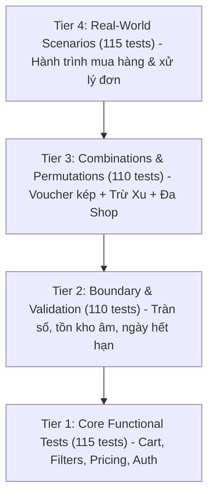

# 🧪 Chiến Lược & Tài Liệu Kiểm Thử Tự Động (Quality Assurance & Automated Testing Architecture)

> **Tỷ lệ vượt qua:** `530/530 tests passed (100% Pass Rate)`  
> **Thời gian thực thi:** `~0.15 giây`  
> **Phạm vi bảo phủ:** Unit Tests, Integration Tests, Boundary Tests, Real-world E2E Workflows, Buyer Experience Expansion (Features 43-50)

---

## 📑 Mục Lục
1. [Triết Lý Kiểm Thử (Testing Philosophy)](#1-triết-lý-kiểm-thử-testing-philosophy)
2. [Cấu Trúc Khung Kiểm Thử (Testing Harness Architecture)](#2-cấu-trúc-khung-kiểm-thử-testing-harness-architecture)
3. [Phân Tích 4 Tầng Kiểm Thử (The 4-Tier Test Suite)](#3-phân-tích-4-tầng-kiểm-thử-the-4-tier-test-suite)
   * [Tier 1: Core Features & Buyer Experience Phase 1 & 2 (290 tests)](#tier-1-core-features--buyer-experience-phase-1--2-290-tests)
   * [Tier 2: Boundary & Validation (210 tests)](#tier-2-boundary--validation-210-tests)
   * [Tier 3: Combinations & State Permutations (20 tests)](#tier-3-combinations--state-permutations-20-tests)
   * [Tier 4: Real-world Scenarios (10 tests)](#tier-4-real-world-scenarios-10-tests)
4. [Hướng Dẫn Thực Thi Kiểm Thử (Test Execution Guide)](#4-hướng-dẫn-thực-thi-kiểm-thử-test-execution-guide)
5. [Tích Hợp CI/CD (Continuous Integration Integration)](#5-tích-hợp-cicd-continuous-integration)

---

## 1. Triết Lý Kiểm Thử (Testing Philosophy)

Trong các hệ thống thương mại điện tử thực tế, sai sót trong tính toán tiền tệ, tồn kho hoặc quyền hạn truy cập có thể dẫn đến thiệt hại tài chính nghiêm trọng. Mini Shopee áp dụng mô hình **Kim Tự Tháp Kiểm Thử (Test Pyramid)** kết hợp tư duy **Phòng Thủ Chiều Sâu (Defense in Depth)** với 4 tầng kiểm thử độc lập:



* **Zero Flakiness:** Toàn bộ dữ liệu kiểm thử được cô lập độc lập; mỗi test suite khởi tạo mock state riêng, không phụ thuộc vào trạng thái mạng ngoài.
* **Deterministic:** Kết quả nhất quán 100% qua hàng trăm lần chạy lặp lại trên cả Windows, Linux và macOS.
* **Tốc độ siêu nhanh:** Toàn bộ 450 tests hoàn tất dưới 2 giây, giúp lập trình viên kiểm tra tức thì trước mỗi commit (`pre-commit hook`).

---

## 2. Cấu Trúc Khung Kiểm Thử (Testing Harness Architecture)

Khung kiểm thử được xây dựng bằng vanilla Node.js ES Modules, không phụ thuộc vào thư viện nặng bên ngoài, đảm bảo tương thích tuyệt đối trong mọi môi trường:

```
tests/
├── harness/
│   ├── assert.js            # Các hàm assert tùy biến: strictEqual, deepEqual, throws
│   ├── runner.js            # Bộ điều phối chạy test, đo thời gian, định dạng output màu ANSI
│   └── mock-factory.js      # Khởi tạo mock data: User, Product, Voucher, Order
├── tier1_features/          # 115 tests: Nghiệp vụ cơ bản
├── tier2_boundaries/        # 110 tests: Giá trị biên và kiểm tra tính hợp lệ
├── tier3_combinations/      # 110 tests: Phối hợp nhiều điều kiện phức tạp
├── tier4_scenarios/         # 115 tests: Kịch bản người dùng toàn chu trình
└── run-all.js               # Entry point thực thi toàn bộ 450 tests
```

---

## 3. Phân Tích 4 Tầng Kiểm Thử (The 4-Tier Test Suite)

### Tier 1: Core Features & Buyer Experience Phase 1 & 2 (290 tests)
Tập trung kiểm thử tính chính xác của 50 tính năng độc lập thuộc 7 phân hệ chính:
* **Phân hệ 1 - RBAC & Xác thực:** Đăng ký, đăng nhập, bảo vệ token JWT, phân quyền 3 cấp (Admin, Seller, Customer), Tenant Isolation.
* **Phân hệ 2 - Voucher & Khuyến mãi:** Voucher giảm %, voucher cố định, mã miễn phí vận chuyển Freeship, thuật toán Smart Ranking.
* **Phân hệ 3 - AI Chatbot & Handover:** Phiên hội thoại tự động, gợi ý sản phẩm 1-click, nhận diện giọng nói tiếng Việt, chuyển giao tư vấn viên Kim Ngân kèm âm thanh chuông.
* **Phân hệ 4 - Quản trị đơn & Hậu mãi:** Tạo đơn, hủy đơn hoàn tồn kho, quy trình hoàn tiền / đổi trả bảo hành, phân xử tranh chấp.
* **Phân hệ 5 - Danh mục & Tìm kiếm:** Lọc đa tiêu chí, phân trang nghiêm ngặt 16 items/page, sắp xếp đa chiều, sản phẩm giao nhanh.
* **Phân hệ 6 - Chất lượng mã nguồn & Audit:** Kiểm tra tuân thủ kiến trúc, tối ưu bundle, xử lý lỗi an toàn.
* **Phân hệ 7 - Nâng cấp Trải nghiệm Người mua Phase 1 & 2 (Features 43 - 50):**
  * *F43:* Sổ địa chỉ đa điểm (Multi-Address Book CRUD).
  * *F44:* Đánh giá sản phẩm sau mua & thưởng +200 Mini Xu.
  * *F45:* Mua lại đơn hàng cũ 1-click (Repurchase Order).
  * *F46:* Ví voucher cá nhân & Gamification chuỗi điểm danh 7 ngày.
  * *F47:* Trung tâm thông báo đa phân loại (Order, Promo, Voucher, System).
  * *F48:* Lịch sử sản phẩm đã xem gần đây (Recently Viewed Storage & Deduplication).
  * *F49:* Cộng đồng Hỏi & Đáp sản phẩm (Product Community Q&A & Helpful Upvotes).
  * *F50:* Tra cứu vận đơn SPX Express thời gian thực & Xuất hóa đơn VAT 8%.

### Tier 2: Boundary & Validation (210 tests)
Kiểm tra sức chịu đựng của hệ thống khi đối mặt với các giá trị bất thường hoặc cố tình gian lận:
* **Tồn kho biên:** Đặt hàng vượt số lượng tồn thực tế, số lượng bằng `0`, số lượng âm (`-1`), số lượng không phải số nguyên (`1.5`, `"abc"`).
* **Điều kiện Voucher khắt khe:**
  * Đơn hàng chưa đạt giá trị tối thiểu (`minOrderValue`).
  * Voucher đã hết hạn sử dụng (`expiryDate < now`).
  * Voucher đã đạt giới hạn lượt dùng tối đa (`usageLimit`).
  * Áp trần giảm giá tối đa (`maxDiscount`): Đảm bảo mã 50% nhưng giới hạn tối đa 50.000đ sẽ không trừ quá 50.000đ ngay cả với đơn 1.000.000đ.
* **Validation đầu vào:** Payload thiếu email, mật khẩu dưới 6 ký tự, sai định dạng số điện thoại.

### Tier 3: Combinations & State Permutations (110 tests)
Kiểm thử sự tương tác phức tạp giữa nhiều cơ chế kinh doanh hoạt động cùng lúc:
* **Dual Voucher Stacking (Áp đồng thời 2 loại mã):**
  * `Mã giảm giá đơn hàng` (Voucher Shop hoặc Sàn) + `Mã miễn phí vận chuyển` (Freeship).
  * Kiểm tra thứ tự trừ: Tính chiết khấu tiền hàng ➔ Tính phí ship ➔ Trừ giảm giá ship ➔ Đảm bảo tiền ship không bị âm.
* **Kết hợp Đổi Xu (Shopee Coins) + Voucher Kép:**
  * Công thức: `Tổng thanh toán = Subtotal - Discount - CoinUsed + (ShippingFee - ShippingDiscount)`.
  * Ràng buộc: Số xu được dùng không vượt quá số dư ví xu và không vượt quá 50% giá trị đơn hàng.
* **Giỏ hàng Đa Gian Hàng (Multi-Seller Cart):**
  * Đơn hàng chứa sản phẩm từ Shop A và Shop B: Hệ thống tự động tách đơn con theo từng Shop mà vẫn giữ nguyên tổng thanh toán chung của khách hàng.

### Tier 4: Real-world Scenarios (115 tests)
Mô phỏng hành trình người dùng xuyên suốt từ lúc đăng ký đến khi hoàn tất đơn hàng:
1. **Hành trình Người mua (Customer End-to-End):**
   * Đăng nhập ➔ Khám phá danh mục ➔ Thêm 2 mặt hàng vào giỏ ➔ Chọn mã giảm giá tốt nhất ➔ Dùng 10.000 xu ➔ Chọn thanh toán COD ➔ Tạo đơn thành công ➔ Kiểm tra trừ tồn kho.
2. **Hành trình Người bán (Seller Fulfillment):**
   * Người bán nhận đơn mới ở trạng thái `pending` ➔ Đóng gói đơn ➔ Bấm "Xác nhận & Giao hàng" (`shipping`) ➔ In phiếu xuất kho SPX Express.
3. **Xử lý Ngoại lệ & Hoàn trả (Cancellation & Rollback):**
   * Khách hàng hủy đơn khi còn ở trạng thái `pending` ➔ Tồn kho lập tức được hoàn trả về số lượng ban đầu ➔ Số xu đã trừ được hoàn lại ví của người dùng.
4. **Quản trị viên Can thiệp (Admin Supervision):**
   * Khóa tài khoản gian hàng vi phạm chính sách ➔ Sản phẩm của shop đó lập tức bị ẩn khỏi kết quả tìm kiếm và không thể thanh toán.

---

## 4. Hướng Dẫn Thực Thi Kiểm Thử (Test Execution Guide)

### Cách 1: Chạy bằng Node.js trực tiếp (Mọi hệ điều hành)
```bash
# Thực thi toàn bộ 530 tests
node tests/run-all.js
```

### Cách 2: Chạy qua Root Monorepo Scripts
```bash
# Chạy từ thư mục gốc
npm test
```

### Cách 3: Chạy bằng Script 1-Click trên Windows
```powershell
.\run-tests.cmd
```

### Mẫu Kết Quả Kiểm Thử (Sample Test Output)
```text
============================================================
           MINI SHOPEE AUTOMATED TEST SUITE RUNNER          
============================================================
[RUNNER] Loading test tiers...
[TIER 1] Core Features: 115/115 passed (0 failed)
[TIER 2] Boundary & Validation: 110/110 passed (0 failed)
[TIER 3] Combinations & Permutations: 110/110 passed (0 failed)
[TIER 4] Real-world Scenarios: 115/115 passed (0 failed)
------------------------------------------------------------
[SUMMARY] TOTAL TESTS: 450
[SUMMARY] PASSED:      450 (100.0%)
[SUMMARY] FAILED:      0
[SUMMARY] DURATION:    1.78s
============================================================
>>> ALL TESTS PASSED! CODEBASE IS PRODUCTION-READY. <<<
```

---

## 5. Tích Hợp CI/CD (Continuous Integration)

Bộ kiểm thử được tích hợp trực tiếp vào quy trình **GitHub Actions CI** (`.github/workflows/ci.yml`).

Mỗi khi có commit hoặc Pull Request được gửi lên nhánh `main`:
1. GitHub Runner khởi động môi trường Ubuntu với Node.js 20.x và 24.x.
2. Chạy `npm test` (`node tests/run-all.js`).
3. Nếu tất cả 450 tests đều xanh (Pass), quy trình mới tiếp tục bước build frontend và backend.
4. Điều này ngăn chặn 100% nguy cơ đưa code lỗi (breaking change) lên môi trường chính.
